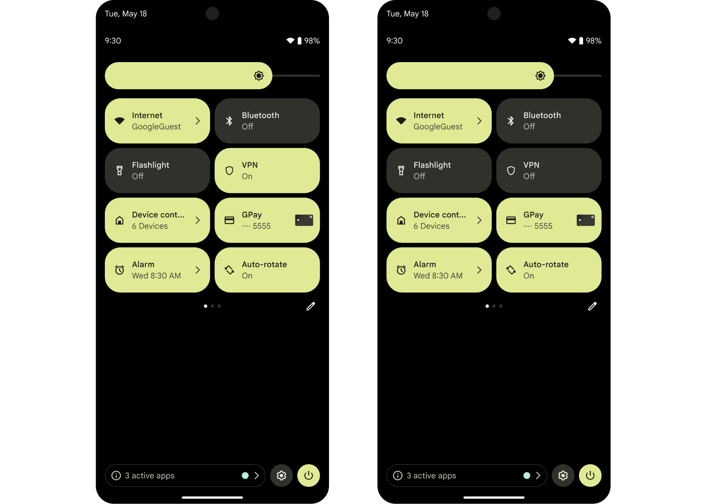

# TileScreen

Simple Android app that demonstrates a Quick Settings Tile (TileService) to capture a quick note, plus a small in-app viewer/editor.

## Repository variants
- XML version: `https://github.com/adirahman/Android-Tile-Service/tree/using-xml-layout`
- Compose version: `https://github.com/adirahman/Android-Tile-Service/tree/using-compose-layout`

By default, the `master` branch uses XML layouts.

## What this app does
- Adds a Quick Settings tile labeled "ARC Quick Notes".
- Tapping the tile opens a lightweight input overlay (`GhostInputActivity`) to edit and save a note.
- The note is stored locally using DataStore (Preferences).
- The main app screen (`MainActivity`) shows the saved note and lets you edit or clear it.

## Quick Settings Tile (TileService)
`TileService` is an Android service that provides a tile inside the Quick Settings panel.

In this project:
- Service class: `app/src/main/java/com/arc/tilescreen/QuickStatusTileService.kt`
- Manifest registration: `app/src/main/AndroidManifest.xml`
  - `android.permission.BIND_QUICK_SETTINGS_TILE`
  - `android.service.quicksettings.action.QS_TILE` intent filter
- `onStartListening()` updates the tile when the QS panel opens.
- `onClick()` opens `GhostInputActivity` and collapses QS.

Even though the service is named `QuickStatusTileService`, the current behavior is to open the note input screen.

## App flow (XML + Activity + Service)

### 1) Main screen
- Layout: `app/src/main/res/layout/activity_main.xml`
- Activity: `app/src/main/java/com/arc/tilescreen/MainActivity.kt`
- Flow:
  - Collects note changes from `QuickNoteStore` and updates `tvQuickNote`.
  - Edit button opens `GhostInputActivity`.
  - Clear button removes note from DataStore.
  - Tapping the card shows a dialog with the current note.

### 2) Ghost input screen (overlay)
- Layout: `app/src/main/res/layout/activity_ghost_input.xml`
- Activity: `app/src/main/java/com/arc/tilescreen/GhostInputActivity.kt`
- Flow:
  - Reads existing note from `QuickNoteStore` and pre-fills the field.
  - Shows the keyboard after layout is ready.
  - Save stores the note and refreshes the tile label/state.
  - Clear deletes the note.
  - Dim area tap closes the screen.

### 3) Tile service
- Service: `app/src/main/java/com/arc/tilescreen/QuickStatusTileService.kt`
- Flow:
  - `onStartListening()` loads the latest tile status from `QuickStatusStore`.
  - `onClick()` opens `GhostInputActivity` with `startActivityAndCollapse()`.

### 4) Status picker (optional)
- Activity: `app/src/main/java/com/arc/tilescreen/PickerActivity.kt`
- Flow:
  - Shows a dialog with `QuickStatus` options.
  - Stores the chosen status in `QuickStatusStore`.
  - Requests the tile to refresh.

## Data layer (DataStore)
- `QuickNoteStore` saves and exposes the note as a `Flow<String>`.
  - File: `app/src/main/java/com/arc/tilescreen/QuickNoteStore.kt`
- `QuickStatusStore` saves and exposes the tile status as a `Flow<QuickStatus>`.
  - File: `app/src/main/java/com/arc/tilescreen/QuickStatusStore.kt`

## Build and run
- Open the project in Android Studio and run the `app` module.
- Add the "ARC Quick Notes" tile from the Quick Settings edit screen.

## Notes
- `GhostInputActivity` uses a custom theme to look like a dimmed overlay.
- Tile labels/state can be customized inside `QuickStatusTileService.render()`.
